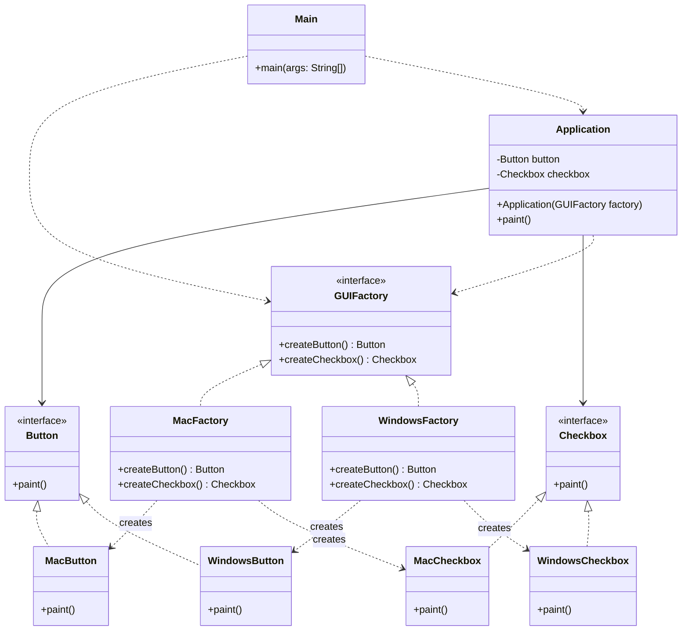

# Abstract Factory Pattern
Think of the Abstract Factory as a 'Factory of Factories'. It is used to create families of related objects (like a set of Windows buttons and checkboxes, or a set of Mac buttons and checkboxes) without specifying their concrete classes. It ensures that all created objects are compatible with each other (e.g., you don't mix Windows buttons with Mac checkboxes).

## Class Diagram

