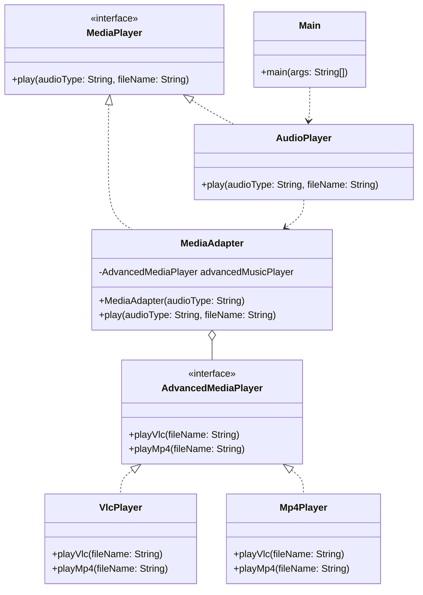

# Adapter Pattern
The Adapter pattern works exactly like a travel plug. If you have an object with an interface that doesn't fit into your system, you don't rewrite the object. Instead, you build an 'Adapter' that acts as a translator between the incompatible interface and the standard your system expects.

## Class Diagram

