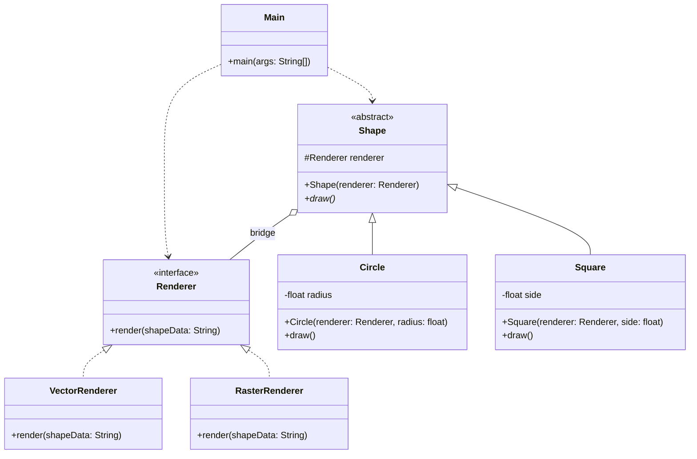

# Bridge Pattern
The Bridge pattern is about separating a big class into two hierarchies: the 'Abstraction' (what it is, e.g., a Shape) and the 'Implementation' (how it's done, e.g., Vector vs Raster rendering). This avoids a 'class explosion' where you'd have to create a class for every combination of shape and renderer.

## Class Diagram

