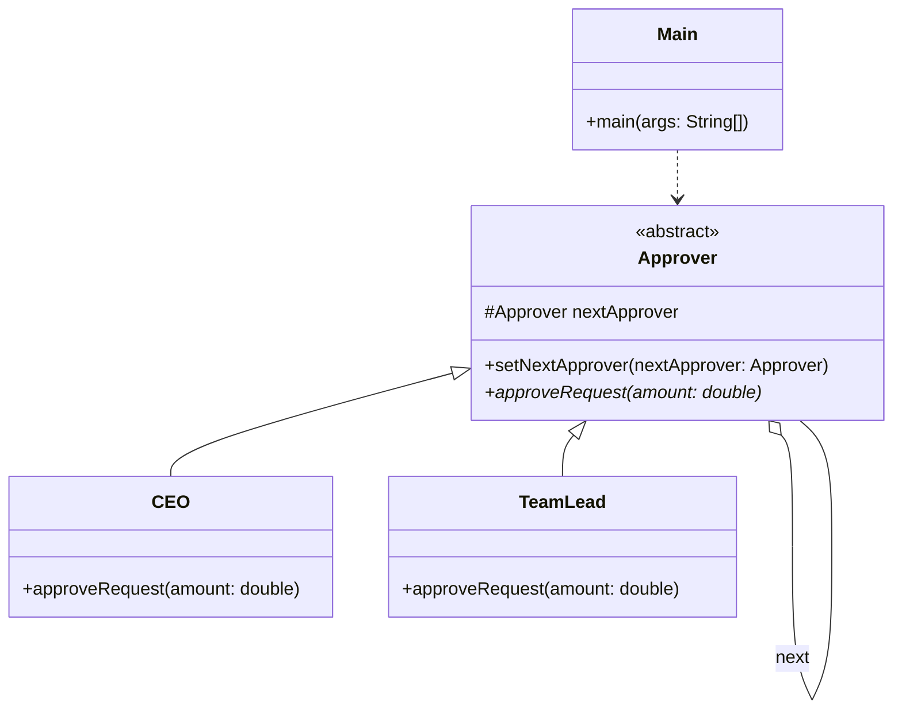

# Chain of Responsibility Pattern
This pattern decouples the sender of a request from its receivers by giving multiple objects a chance to handle the request. Each handler in the chain either processes the request or passes it to the next link. It's like a corporate approval process where a TeamLead can approve small amounts, but expensive requests must go up to the CEO.

## Class Diagram

