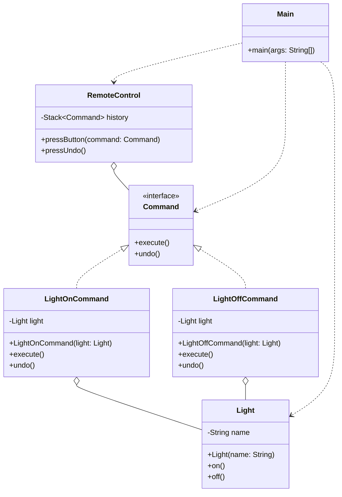

# Command Pattern
The Command pattern turns a request into a stand-alone object. This object contains all the information needed to perform the action. This is powerful because it allows us to queue requests, pass them as arguments, and most importantly, it makes implementing 'Undo' very easy by storing the reverse action in the same object.

## Class Diagram

