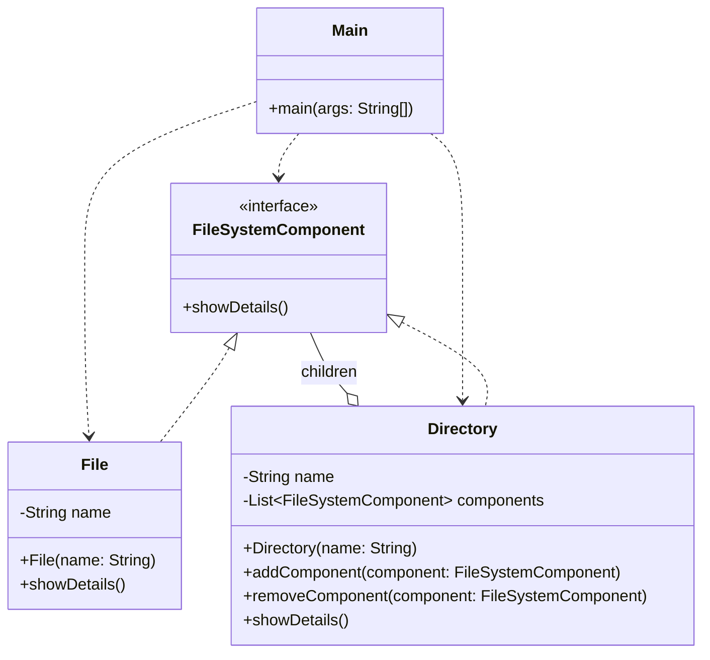

# Composite Pattern
The Composite pattern is used to represent tree structures. It allows you to treat individual objects (Leaves) and groups of objects (Composites) the same way. A classic example is a file system where a folder can contain files or even other folders, but you can call 'showDetails' on both.

## Class Diagram

