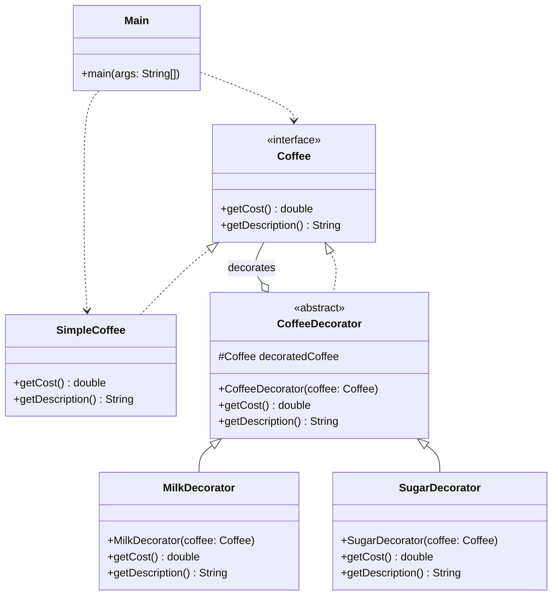

# Decorator Pattern
The Decorator pattern is like adding toppings to a pizza or ingredients to a coffee. You start with a base object and wrap it in 'Decorators' that add new functionality. Each decorator has the same interface as the object it wraps, so you can stack them like layers of an onion.

## Class Diagram

