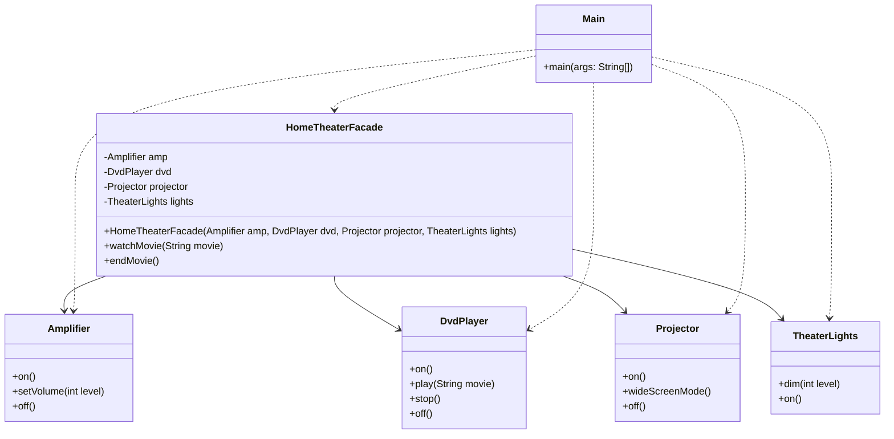

# Facade Pattern
The Facade pattern provides a simplified interface to a complex subsystem. Instead of making the client talk to 10 different classes to get a job done, the client talks to one 'Facade' class that handles all the complicated interactions in the background. It's like a universal remote for your home theater.

## Class Diagram

