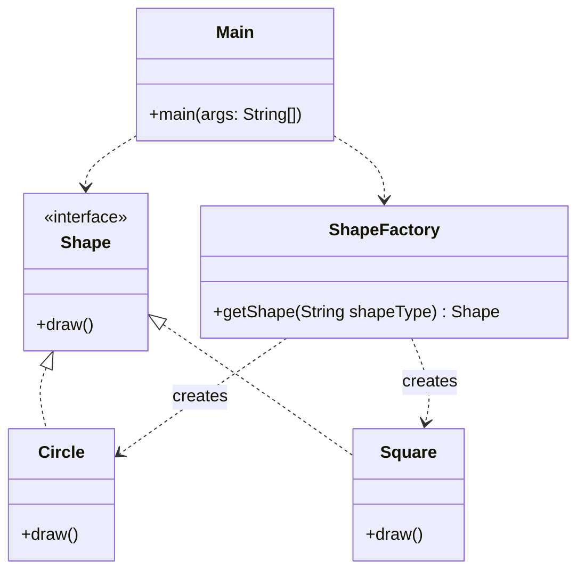

# Factory Pattern
The Factory pattern is all about hiding the complexity of object creation. Instead of the client using 'new' to create specific objects, it asks a Factory to do it. This makes the code more flexible because we can add new types of objects without changing the client code.

## Class Diagram

