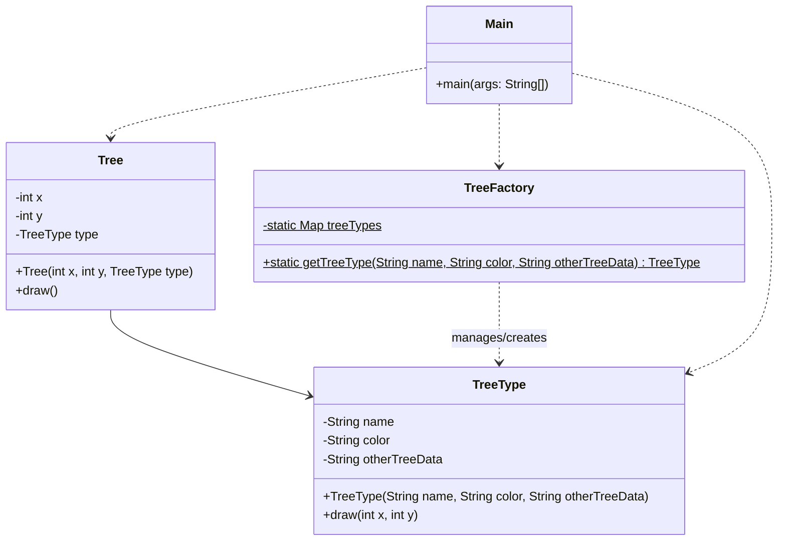

# Flyweight Pattern
The Flyweight pattern is used for optimization. When you have a massive amount of similar objects (like 10,000 trees in a game), you don't want each object to store the same heavy data (like textures). Instead, you store the shared data once and each object just keeps a reference to it. This saves a lot of memory.

## Class Diagram

