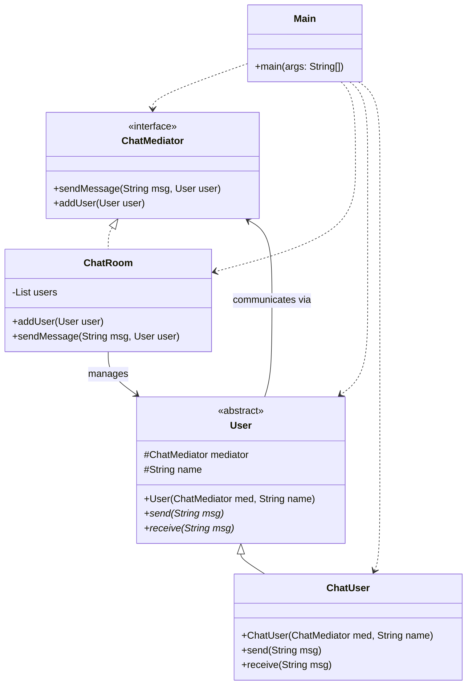

# Mediator Pattern
The Mediator pattern is like an Air Traffic Control tower. Instead of every pilot talking to every other pilot (which would be chaos), everyone talks only to the tower. The tower coordinates everything. This reduces the dependencies between objects and makes the system much easier to maintain.

## Class Diagram

