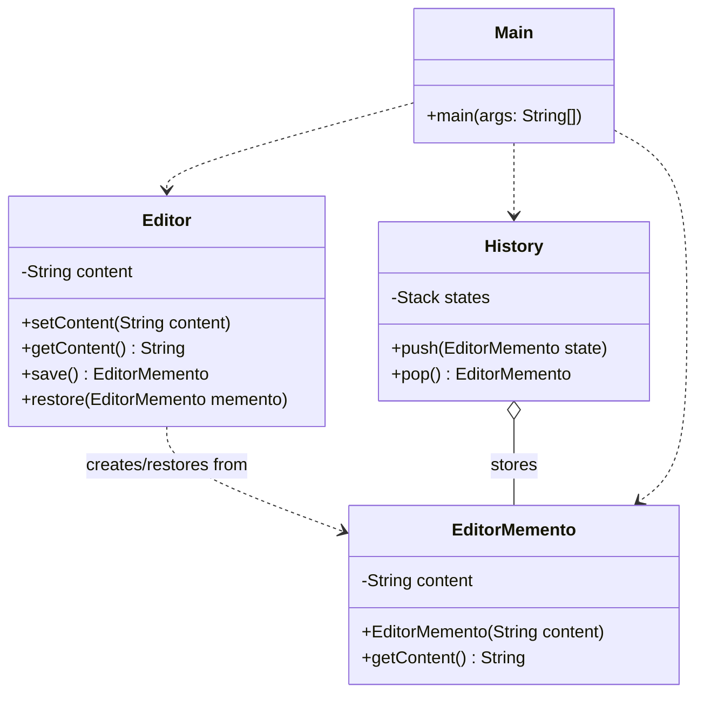

# Memento Pattern
The Memento pattern is used to restore an object to a previous state. Think of it as a 'Save Game' or 'Snapshot' feature. It captures the internal state of an object without breaking its encapsulation, stores it safely outside, and allows you to roll back whenever you want.

## Class Diagram

