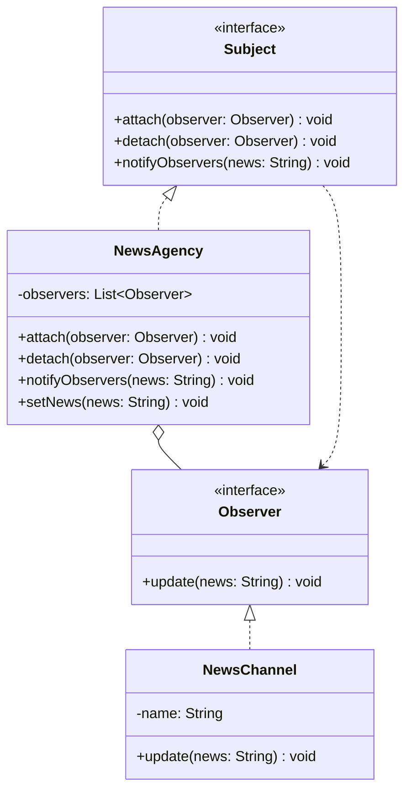

# Observer Pattern
This pattern is like a subscription service. A central object (the Subject) keeps a list of followers (Observers) and automatically pings them whenever something changes. It is great for decoupling: the Subject does not need to know the details of its followers, it just knows they want updates.

## Class Diagram

