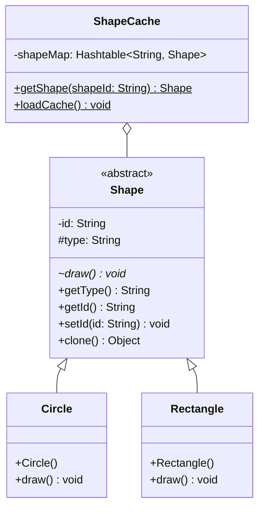

# Prototype Pattern
The Prototype pattern is used when creating a new object from scratch is too expensive (like doing complex database queries). Instead, we take an existing object (the 'Prototype') and clone it. This is much faster and more efficient.

## Class Diagram

