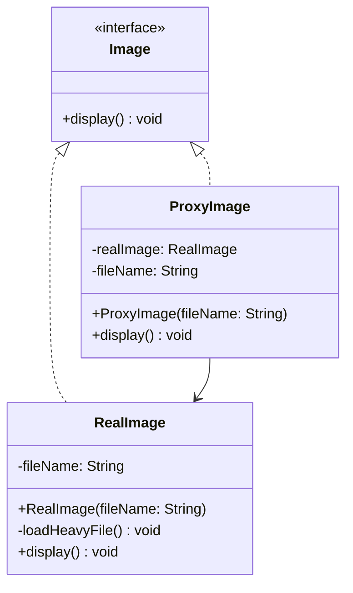

# Proxy Pattern
The Proxy pattern acts as a placeholder or a 'gatekeeper' for another object. In this example, we use it for Lazy Loading: we show a 'cheap' thumbnail immediately and only load the 'expensive' high-resolution image when the user actually clicks on it. This saves time and memory.

## Class Diagram

