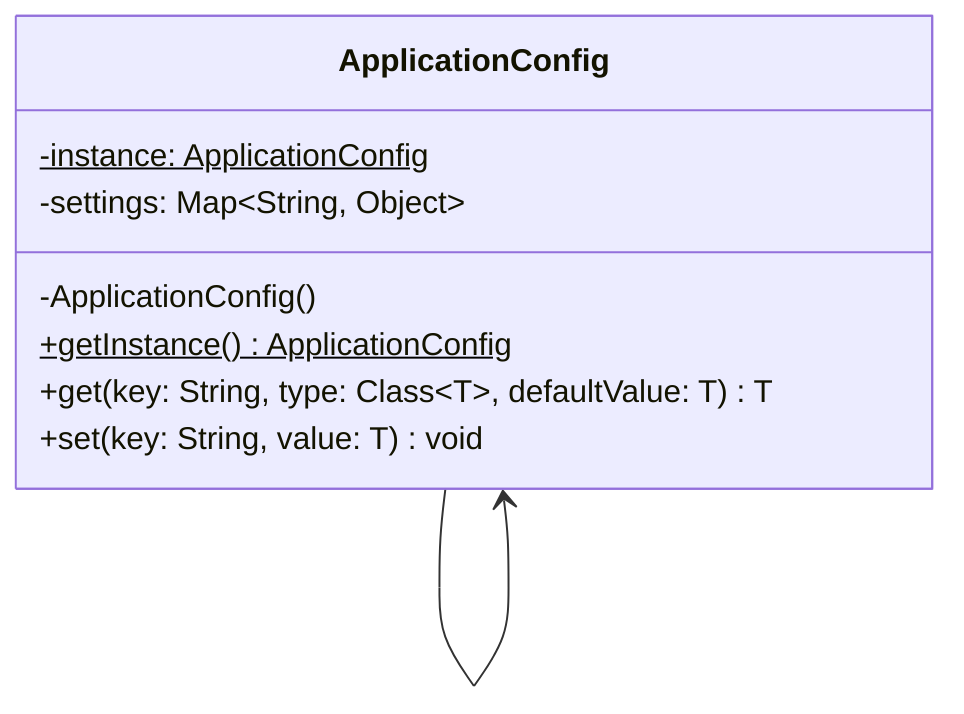

# Singleton Pattern (Classic)
This is the standard way to implement a Singleton. It uses a private constructor and a static method to provide a single point of access. It also uses lazy initialization, meaning the instance is only created when it is actually needed.

## Class Diagram

