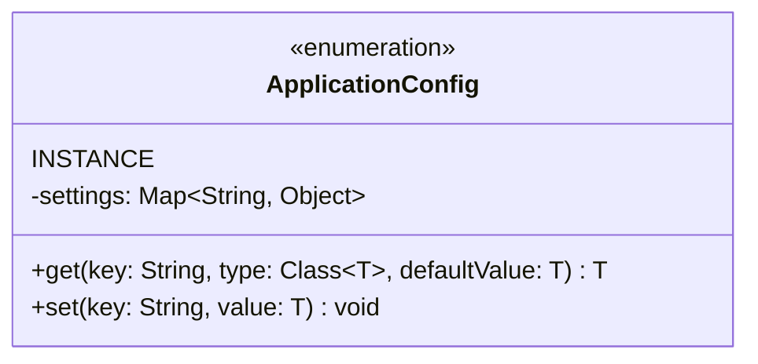

# Singleton Pattern (Enum)
Using an Enum is the most modern and recommended way to implement a Singleton in Java. It provides protection against serialization and reflection attacks automatically. It is simple, thread-safe, and very hard to break.

## Class Diagram

