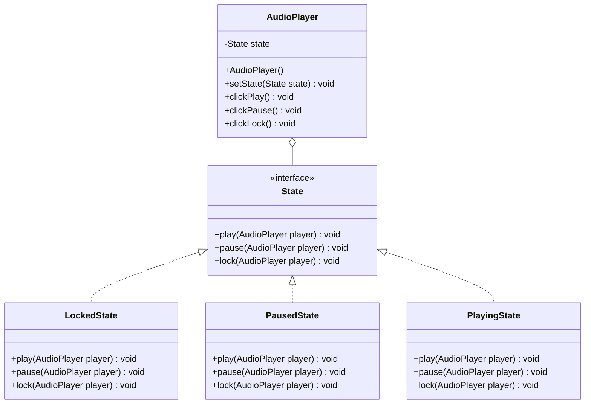

# State Pattern
The State pattern allows an object to change its behavior when its internal state changes. Instead of using a giant 'if-else' or 'switch' block in every method, each state is its own class. This makes the code much cleaner and easier to extend with new states. It's like an audio player that reacts differently to the 'play' button depending on whether it's already playing, paused, or locked.

## Class Diagram

