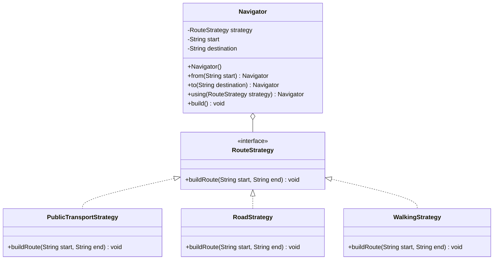

# Strategy Pattern
This pattern allows us to swap algorithms at runtime. It defines a family of algorithms and makes them interchangeable. This is useful when we have different ways to do the same thing (like calculating a route) and we want to switch between them without changing the client code.

## Class Diagram

