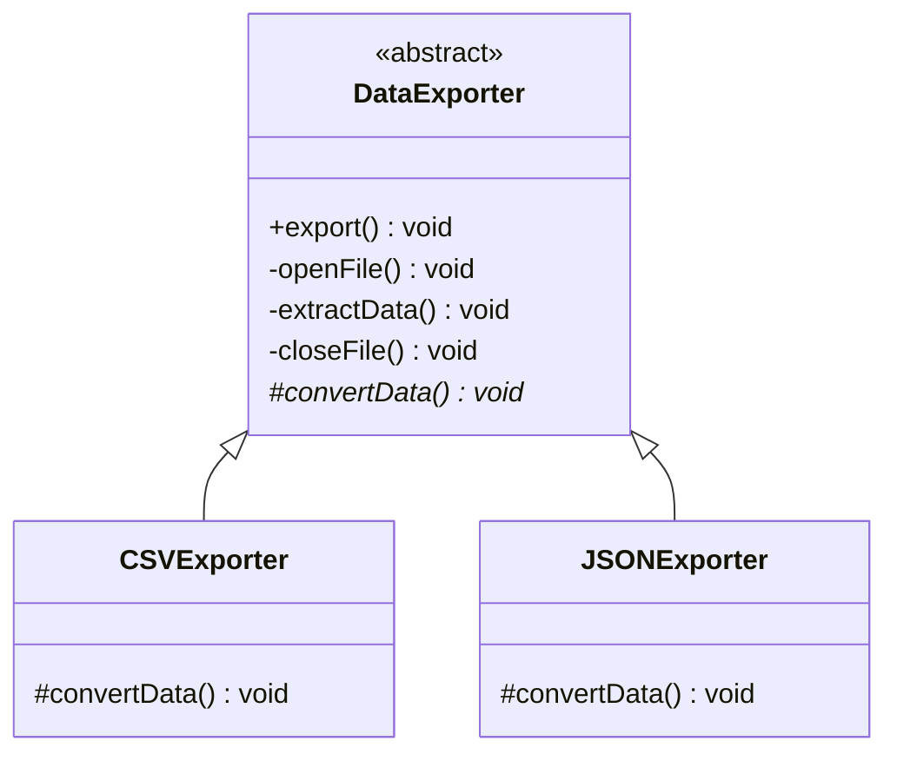

# Template Method Pattern
The Template Method pattern defines the skeleton of an algorithm in a base class but lets subclasses override specific steps without changing the overall structure. It's like a recipe where the order of steps (boil water, add ingredients, serve) is fixed, but you can choose which specific ingredients to add.

## Class Diagram

