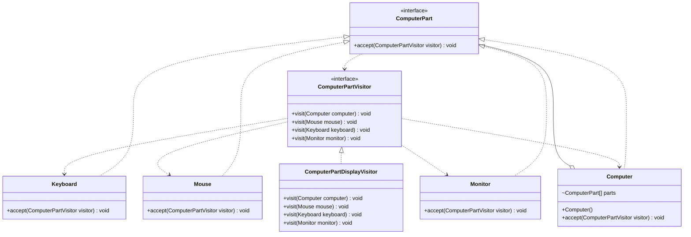

# Visitor Pattern
The Visitor pattern allows you to add new operations to an existing object structure without modifying the objects themselves. It separates the algorithm from the object structure. Think of it as an 'External Specialist' (the Visitor) who visits different rooms in a house (the Objects). The rooms stay the same, but different visitors can perform different tasks in them (one cleans, one inspects, one evaluates).

## Class Diagram

